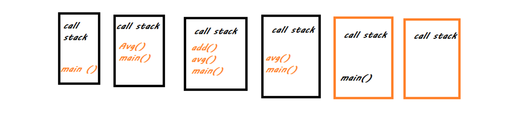

# Read: Class 10

## What is a ‘call’?

- **The call stack** works based on last in first out When the current function completes, the JavaScript engine pops it off the call stack and resumes the execution where it left off in the last code listing. The script will stop when the call stack is empty.

## How many ‘calls’ can happen at once?

- The JavaScript engine has **only one call stack** so that it only can do one thing at a time.

## What does LIFO mean?

- Last in first out which mean that the last function will be executed first and so on .

## Draw an example of a call stack and the functions that would need to be invoked to generate that call stack.

### function add(a, b) { return a + b; }

### function avg(a, b) { return add(a, b) / 2; }

**let x = avg(10, 20);**

## What causes a Stack Overflow?

- Occures when there is a recursive function (a function that calls itself) without an exit point.

## What is a ‘refrence error’?

- The ReferenceError object represents an error when a non-existent variable is referenced.

## What is a ‘syntax error

- The SyntaxError object represents an error when trying to interpret syntactically invalid code. It is thrown when the JavaScript engine encounters tokens or token order that does not conform to the syntax of the language when parsing code.

## What is a ‘range error’?

- A RangeError is thrown when trying to pass a value as an argument to a function that does not allow a range that includes the value.

## What is a ‘tyep error’?

- TypeError may be thrown when: an operand or argument passed to a function is incompatible with the type expected by that operator or function.

## What does the word ‘debugger’ do in your code?

Stops the execution of JavaScript, and call's (if available) the debugging function.

