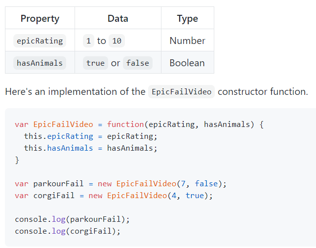

### Object-Oriented Programming, HTML Tables"

### Domain Modeling

+ Domain modeling is the process of creating a conceptual model in code for a specific problem. A model describes the various entities, their attributes and behaviors, as well as the constraints that govern the problem domain. An entity that stores data in properties and encapsulates behaviors in methods is commonly referred to as an object-oriented model.

### Define a constructor and initialize properties

To define the same properties between many objects, you'll want to use a constructor function. Below is a table that summarizes a JavaScript representation of an EpicFailVideo object.

+ As you can see, the constructor function is defined using a function expression. In other words, the variable EpicFailVideo is declared and then assigned a function with two parameters called epicRating and hasAnimals.

+ When the function is called, the data inside these parameters are stored inside the this.epicRating and this.hasAnimals properties respectively. Storing data within properties ensures any newly created object can access that data later.

### Generate random numbers :

+ var EpicFailVideo = function(epicRating, hasAnimals) {
  this.epicRating = epicRating;
  this.hasAnimals = hasAnimals;
}

EpicFailVideo.prototype.generateRandom = function(min, max) {
  return Math.floor(Math.random() * (max - min + 1)) + min;
}

- var parkourFail = new EpicFailVideo(7, false);
* var corgiFail = new EpicFailVideo(4, true);

console.log(parkourFail.generateRandom(1, 5));
console.log(corgiFail.generateRandom(1, 5));
 

 ### As you can see, methods can be added to a constructor function's prototype. Think of the prototype as an object's stunt double. Whenever a scene is too dangerous, you can substitute in the prototype to do the work while the object takes all the glory. More on how that works below.

 ## Calculate daily Likes :

+Popularity of a video is measured in Likes. And the formula for calculating Likes is the number of viewers times the percentage of viewers who'll Like a video. In other words, viewers times percentage.

+ To calculate the number of viewers per day, generate a random number between 10 and 30 and then multiply it by the epic rating of that video.

+ what is Table ?

A table represents information in a grid format. Examples of tables include financial reports, TV schedules, and sports results.

### Basic Table Structure:

+ < table>
The < table> element is used to create a table. The contents of the table are written out row
by row.
+ < tr>
You indicate the start of each , row using the opening < tr> tag , (The tr stands for table row.) It is followed by one or more
< td> elements (one for each cell).

- < td>
Each cell of a table is represented using a < td> element. (The td stands for table data.)

### Table Headings:<tH>:

+ The < tH> element is used just ,like the < td> element but its ,purpose is to represent the heading for either a column or a row. (The th stands for table
heading.) .

### Long Tables:

+ < thead>
The headings of the table should sit inside the < thead> element.

+ < tbody>
The body should sit inside the < tbody> element.

+ < tfoot>
The footer belongs inside the < tfoot> element.
By default, browsers rarely treat the content of these elements
any differently than other elements however designers often use CSS styles to change their appearance.

### Spanning Rows:

You may also need entries in a table to stretch down across more than one row.
The rowspan attribute can be used on a < th> or < td> element to indicate how many rows a cell
should span down the table.

### WHAT IS AN OBJECT? 

+ Objects group together a set of variables and functions to create a model of a something you would recognize from the real world. In an object, variables and functions take on new names. 

### IN AN OBJECT: VARIABLES BECOME
KNOWN AS PROPERTIES If a variable is part of an object, it is called a
property. Properties tell us about the object, such as the name of a hotel or the number of rooms it has.
Each individual hotel might have a different name and a different number of rooms. 

**IN AN OBJECT**: FUNCTIONS BECOME KNOWN AS METHODS If a function is part of an object, it is called a method.
Methods represent tasks that are associated with the object. For example, you can check how many rooms are available by subtracting the number of booked rooms from the total number of rooms. 

**EX** This object represents a hotel. It has five properties and one method.The object is in curly braces. It is stored in a variable called hotel .

### CREATING· OBJECTS USING LITERAL NOTATION:
 + This example : starts by creating an object using literal notation.
This object is called hotel which represents a hotel called Quay
with 40 rooms (25 of which have been booked).
Next, the content of the page is updated with data from this
object. It shows the name of the hotel by accessing the object's name property and the number of vacant rooms using the checkAvail ability() method.
To access a property of this object, the object name is followed by a dot (the period symbol) and the name of the
property that you want. Similarly, to use the method,
you can use the object name followed by the method name.
hotel . checkAvailability() .

### CREATING OBJECTS USING CONSTRUCTOR SYNTAX :
Once it has been created, three properties and a method are
then assigned to the object. (If the object already had any
of these properties, this would overwrite the values in those
properties.)
To access a property of this object, you can use dot notation,
just as you can with any object. For example, to get the hotel's
name you could use:
hotel .name
Similarly, to use the method, you can use the object name followed by the method name:
hotel.checkAvailability(1,2,3)

### ADDING AND REMOVING PROPERTIES:

Once you have created an object (using literal or constructor
notation), you can add new
properties to it. You do this using the dot notation that you saw for adding properties to objects on pl03.
In this example, you can see that an instance of the hotel object
is created using an object literal.
Immediately after this, the hotel object is given two extra properties that show the facilities (whether or not it has a gym and/or a pool). These properties are given values that are Booleans (true or false).
Having added these properties to the object, you can access them just like any of the objects
other properties. Here, they update the value of the cl ass attribute on their respective elements to show either a check mark or a cross mark.
To delete a property, you use the keyword delete, and then use dot notation to identify the
property or method you want to remove from the object. In this case, the booked property is removed from the object.

### WHAT ARE BUILT-IN OBJECTS?
Browsers come with a set of built-in objects that represent things like the browser window and the current web page shown in that window. These built-in objects act like a toolkit for creating interactive web pages. The objects you create will usually be specifically written to suit your needs. They model the data used within, or contain functionality needed by, your script. Whereas, the built-in objects contain functionality.

### GLOBAL OBJECTS:
+ GLOBAL OBJECTS:
NUMBER OBJECT
+ NUMBER OBJECT 

## summary :

+ Functions allow you to group a set of related
statements together that represent a single task.

+ Functions can take parameters (informatiorJ required
to do their job) and may return a value.

+ An object is a series of variables and functions that
represent something from the world around you.

+ In an object, variables are known as properties of the
object; functions are known as methods of the object.

+ Web browsers implement objects that represent both
the browser window and the document loaded into the
browser window.

+ JavaScript also has several built-in objects such as
String, Number, Math, and Date. Their properties and
methods offer functionality that help you write scripts.

+ Arrays and objects can be used to create complex data
sets (and both can contain the other). 