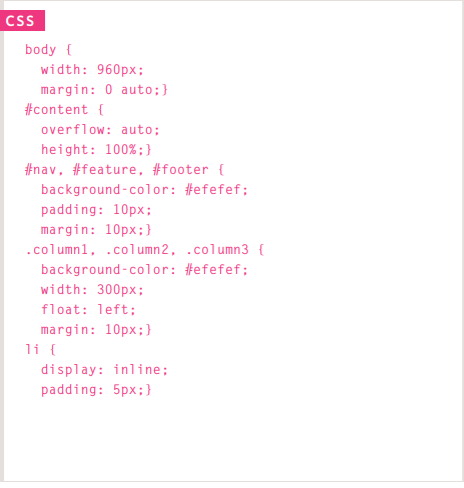
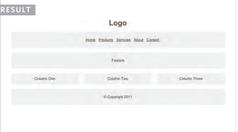
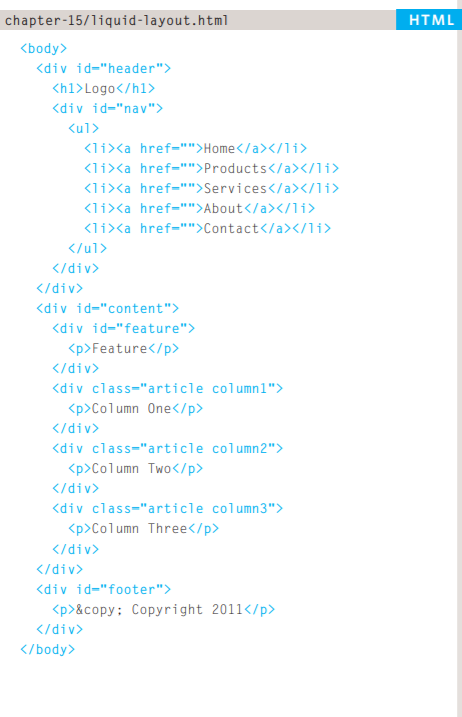
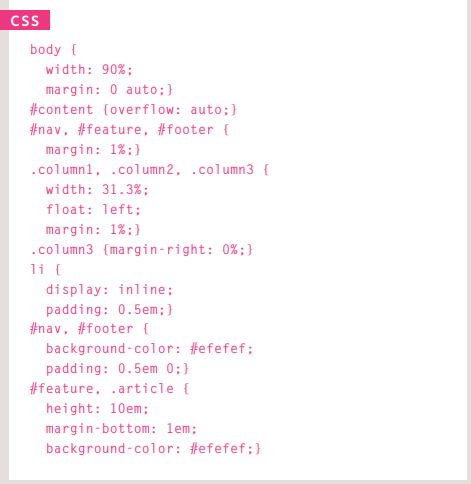
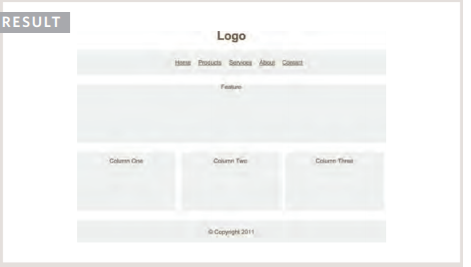
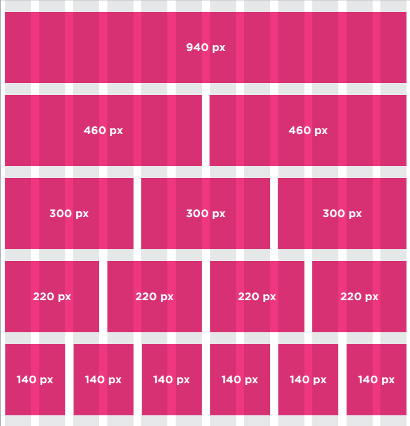

# Fixed Width Layouts :

+ Fixed width layout designs do not change size as the user increases
or decreases the size of their browser window. Measurements tend
to be given in pixels.

**Some** of Advantages :
● Pixel values are accurate at controlling size and
positioning of elements.

● The designer has far greater control over the appearance and position of items on the page than with liquid layouts.

**Some** of Advantages :
● You can end up with big gaps around the edge of a page.

● If the user's screen is a much higher resolution than the
designer's screen, the page can look smaller and text can
be harder to read.

### Liquid Layouts:

+ Liquid layout designs stretch and contract as the user increases
or decreases the size of their browser
window. They tend to use percentages.

**Some** of Advantages :

● Pages expand to fill the entire browser window so there are
no spaces around the page on a large screen.

● If the user has a small window, the page can contract to fit it without the user having to scroll to the side.

**some** of Disadvantages :

● If you do not control the width of sections of the page
then the design can look very different than you intended,
with unexpected gaps around certain elements or items
squashed together.

● If the user has a wide window, lines of text can
become very long, which makes them harder to read.

### A Fixed Width Layout:

+ To create a fixed width layout, the width of the main boxes on
a page will usually be specified in pixels (and sometimes their
height, too)

+ The fixed width layout will stay the same width no matter what
size the browser window is, whereas the liquid layout will
stretch (or shrink) to fill the screen.

+ The HTML is the same for both the fixed width layout.

+ The rule for the **< body>** element is used to fix the width of the
page at 960 pixels, and it is centered by setting the left and
right margins to auto. 

### A Liquid Layout :

+ The liquid layout uses percentages to specify the width
of each box so that the design will stretch to fit the size of the
screen.

**note caption of example:**

+ There is a rule on the **< body>** element to set the width of the
page to 90% so that there is a small gap between the left and
right-hand sides of the browser window and the main content.

### so at css ..

+ The three columns are all given a margin of 1% and a width of
31.3%. This adds up to 99.9% of the width of the **< body>**
element, so some browsers might not perfectly align the right-hand side of the third column with other elements on the page. 

## Layout Grids :

+ Composition in any visual art (such as design, painting, or photography)
is the placement or arrangement of visual elements — how they are
organized on a page. Many designers use a grid structure to help them
position items on a page, and the same is true for web designers.

### while a grid might seem like a restriction, in actual fact it:

● Creates a continuity between different pages which may
use different designs.

● Helps users predict where to find information on various
pages.

● Makes it easier to add new content to the site in a
consistent way.

● Helps people collaborate on the design of a site in a
consistent way.

### Possible Layouts:
960 Pixel wide
12 Column Grid

