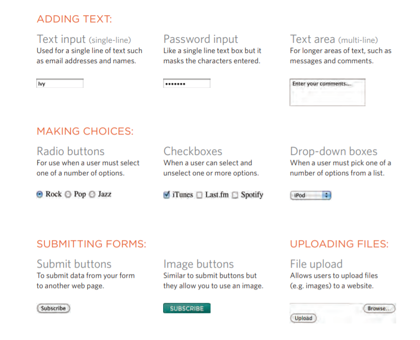

## Forms and Events:

### summary of tables :

+ The < table> element is used to add tables to a web
page.

+ A table is drawn out row by row. Each row is created
with the < tr> element.

+ Inside each row there are a number of cells
represented by the < td> element (or < th> if it is a
header).

+ You can make cells of a table span more than one row
or column using the rowspan and colspan attributes.

+ For long tables you can split the table into a < thead>,
< tbody>, and < tfoot>.

## FORMS:

### Why Forms?u will guess  :

+ The best known form on the web is probably the search box 
that sits right in the middle ofGoogle's homepage.

+ In addition to enabling users to search, forms also allow users
to perform other functions online. You will see forms.

## Form Controls:

There are several types of form controls that you can use to collect information from visitors
to your site , as u see here:

### How Forms Work !!

**first:**
+ A user fills in a form and then presses a buttonto submit the information to the server.

**Second:**
The name of each form control is sent to the server along with the value the user enters or
selects.

**Third:**
The server processes the information using a programming language such as PHP, C#, VB.net,
or Java. It may also store the information in a database.

**Fourth:**
The server creates a new page to send back to the browser based on the
information received.

### A form may have several form controls
 each gathering different information. The server needs to know which piece of inputted data
corresponds with which form element.

## Form Structure :

+ **< form>:**

Form controls live inside a < form> element. This element should always carry the action
attribute and will usually have a method and id attribute too.

**action:**
Every < form> element requires an action attribute. Its value is the URL for the page on the
server that will receive the information in the form when it is submitted.

### method :

**Forms** can be sent using one of two methods: **get or post**.

+With the get method, the values from the form are added to
the end of the URL specified in the action attribute. The get
method is ideal for:
 
● short forms (such as search boxes).

● when you are just retrieving data from the web server
(not sending information that should be added to or deleted
from a database).

## Text Input :

**< input>:**

The < input> element is used to create several different formcontrols. 
The value of the type attribute determines what kindof input they will 
be creating.

**type="text"**
When the type attribute has a value of text, it creates a singleline text
 input.

### Password Input:

**< input>**
**type="password"**

When the type attribute has a value of password it createsa text box that 
acts just like a single-line text input, except the characters are 
blocked out. They are hidden in this way so that if someone is looking over
the user's shoulder, they cannot see sensitive data such as passwords.

### Text Are :

The < textarea> element is used to create a mutli-line
text input. Unlike other input elements this is not an empty
element. It should therefore have an opening and a closing tag.
Any text that appears between the opening < textarea> and
closing < /textarea> tags will appear in the text box when the
page loads.

If the user does not delete any text between these tags, this
message will get sent to the server along with whatever the 
user has typed. (Some sites use JavaScript to clear this
information when the user clicks in the text area.)

### Radio Button:

**< input>:**
**type="radio"**

Radio buttons allow users to pick just one of a number of options.
 

 ### Checkbox :
+ type=checkbox
Checkboxes allow users to select (and unselect) one or more
options in answer to a question The name attribute is sent to
the server with the value of the option(s) the user selects. When
a question provides users with options for answers in the form
of checkboxes, the value of the name attribute should be the
same for all of the buttons that answer that question.

### Drop Down List Box :
-select-
A drop down list box (also known as a select box) allows
users to select one option from a drop down list.
The -select- element is used to create a drop down list box. It
contains two or more -option- elements. 

### Multiple Select Box :
+ -select-
size
You can turn a drop down select box into a box that shows more
than one option by adding the size attribute. Its value should
be the number of options you want to show at once. In the
example you can see that three of the four options are shown.

### File Input Box :
+ -input-
If you want to allow users to upload a file (for example an
image, video, mp3, or a PDF), you will need to use a file input
box. type="file".

## Submit Button :
+ -input-
type="submit" The submit button is used tosend a form to the
 server.name It can use a name attribute but it does not need 
 to have one.

 ### Image Button :
 + -input-
type=-image-
If you want to use an image for the submit button, you can givethe
type attribute a value ofimage. The src, width, height,
and alt attributes work just like they do when used with the
-img- element (which we sawon pages 99-100) .

### Button & hidden Controls :
-button-
The -button- element was introduced to allow users more
control over how their buttons appear, and to allow other
elements to appear inside the button.
This means that you can combine text and imagesbetween the 
opening -button- tag and closing -button- tag.

### Labelling Form Controls:
+ -label-
When introducing form controls, the code was kept simple by
indicating the purpose of each one in text next to it. However,
each form control should have its own -label- element as this 
makes the form accessible to vision-impaired users.

### Grouping Form Elements :
+ -fieldset-
You can group related form controls together inside the
-fieldset- element. This is particularly helpful for longer
forms.
Most browsers will show the fieldset with a line around
the edge to show how they are related. The appearance of these
lines can be adjusted using CSS.

+ -legend-
The -legend- element can come directly after the opening
-fieldset- tag and contains acaption which helps identify the
purpose of that group of formcontrols.

### HTML5: Form Validation:
You have probably seen forms on the web that give users
messages if the form control has not been filled in correctly; this is
known as form validation. Traditionally, form validation
has been performed using JavaScript (which is beyond the
scope of this book). But HTML5 is introducing validation and
leaving the work to the browser.

-**input**-
Many forms need to gather information such as dates, email addresses, and URLs.
 This has traditionally been done usingtext inputs.
HTML5 introduces new form controls to standardize the way that some information is
gathered.
 Older browsers that do not recognize these inputs will just treat them as a single
line text box.
type=-date-
If you are asking the user for a date, you can use an -input- element and give the
 type attribute a value of date.
This will create a date input inbrowsers that support the new HMTL5 input types.

### HTML5: Email & URL Input :
+ -input-
type="email"If you ask a user for an emailaddress, you can use the email
input.

type="url" A URL input can be used whenyou are asking a user for a web
page address

### HTML5: Search Input :
+ -input-
If you want to create a singleline text box for search queries,
HTML5 provides a special type of input for that purpose.
type="search" If you want to create a singleline text box for search
queries,HTML5 provides a special search input.

### Summary:

+  Whenever you want to collect information from visitors you will need a form, which lives inside a
      form - element.
+  Information from a form is sent in name/value pairs.
+  Each form control is given a name, and the text the user types in or the values of the options they
  select are sent to the server.
+ X HTML5 introduces new form elements which make it easier for visitors to fill in forms.

## Bullet Point Styles

### list-style-type:

The list-style-type property allows you to control the shape
or style of a bullet point (also known as a marker).
It can be used on rules that apply to the **< ol>** , **< ul>**, and 
**< li>** elements.

## Images for Bullets:

### list-style-image:

+ You can specify an image to act as a bullet point using the 
list-style-image property.

+ The value starts with the letters url and is followed by a pair of parentheses.
 Inside the parentheses, the path to the image is given inside doublequotes.

 ### Positioning the Marker :

 + Lists are indented into the page by default and the list-styleposition property indicates
whether the marker should appear on the inside or the outside of the box containing the
main points.

### List Shorthand:

+As with several of the other CSS properties, there is a property that acts as a shorthand for list
styles. It is called list-style, and it allows you to express the markers' style, image and
position properties in any order.

### Table Properties:

+ width to set the width of the table.

+ padding to set the space between the border of each table
cell and its content

+ text-transform to convert the content of the table headers to
uppercase.

letter-spacing, font-size to add additional styling to the content
 of the table headers

+ border-top, border-bottom to set borders above and below the table 
headers.
+ text-align to align the writing to the left of some table cells and
to the right of the others.

+ background-color to change the background color of the alternating table rows

+ **:hover** to highlight a table row when a user's mouse goes over it.

### Border on Empty Cells :

+If you have empty cells in your table, then you can use
the empty-cells property to specify whether or not their
borders should be shown.

## Styling Forms :

It is most common to style:
● Text inputs and text areas.
● Submit buttons.
● Labels on forms, to get the form controls to align nicely.

### Web Developer Toolbar:
This helpful extension for Firefox and Chrome
provides tools to show you the CSS styles that
apply to an element when you hover over it,
along with the structure of the HTML.

## Summary of summary :

### LISTS, TABLES AND FORMS:

+ In addition to the CSS properties covered in other
chapters which work with the contents of all elements,
there are several others that are specifically used to
control the appearance of lists, tables, and forms.
+ List markers can be given different appearances
using the list-style-type and list-style image
properties.
+ Table cells can have different borders and spacing in
different browsers, but there are properties you can
use to control them and make them more consistent.
+ Forms are easier to use if the form controls are
vertically aligned using CSS.
+ Forms benefit from styles that make them feel more
interactive.

### EVENTS at JAVA script :

### JavaScript's interaction with HTML is handled through events that occur when 
the user or the browser manipulates a page. When the page loads, it is called an event.
 When the user clicks a button, that click too is an event. Other examples include events
 like pressing any key, closing a window, resizing a window, etc.

### onclick Event Type:
This is the most frequently used event type which occurs when a user clicks the left button 
of his mouse. You can put your validation, warning etc., against this event type.

### onsubmit Event Type:
onsubmit is an event that occurs when you try to submit a form. You can put your form validation
 against this event type.

 ### onmouseover and onmouseout
These two event types will help you create nice effects with images or even with text as well. The onmouseover 
event triggers when you bring your mouse over any element and the onmouseout triggers when you move your mouse 
out from that element.