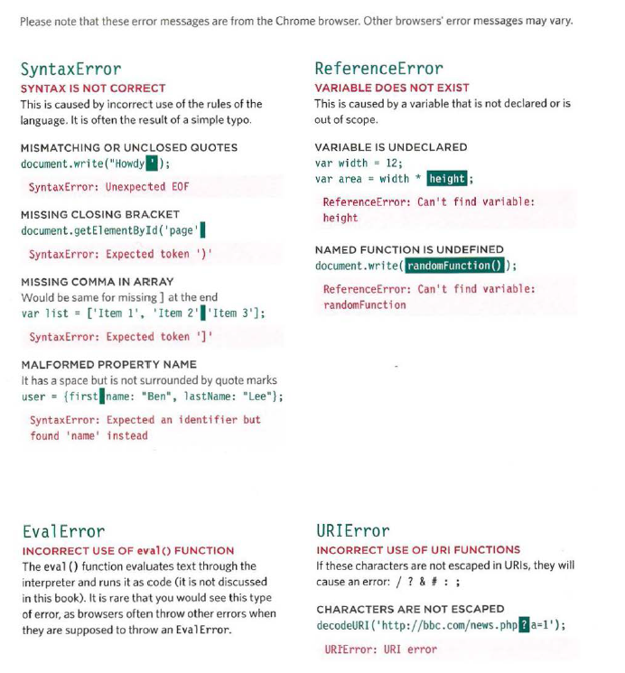
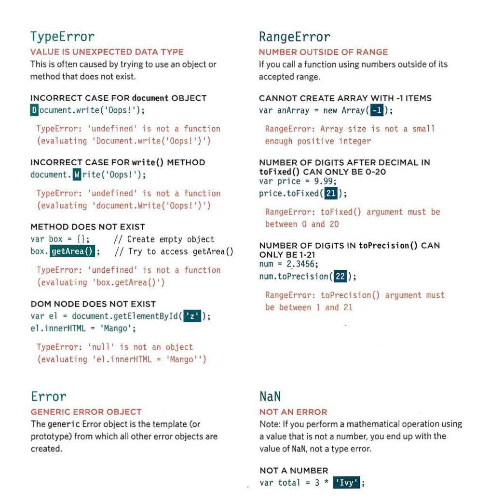
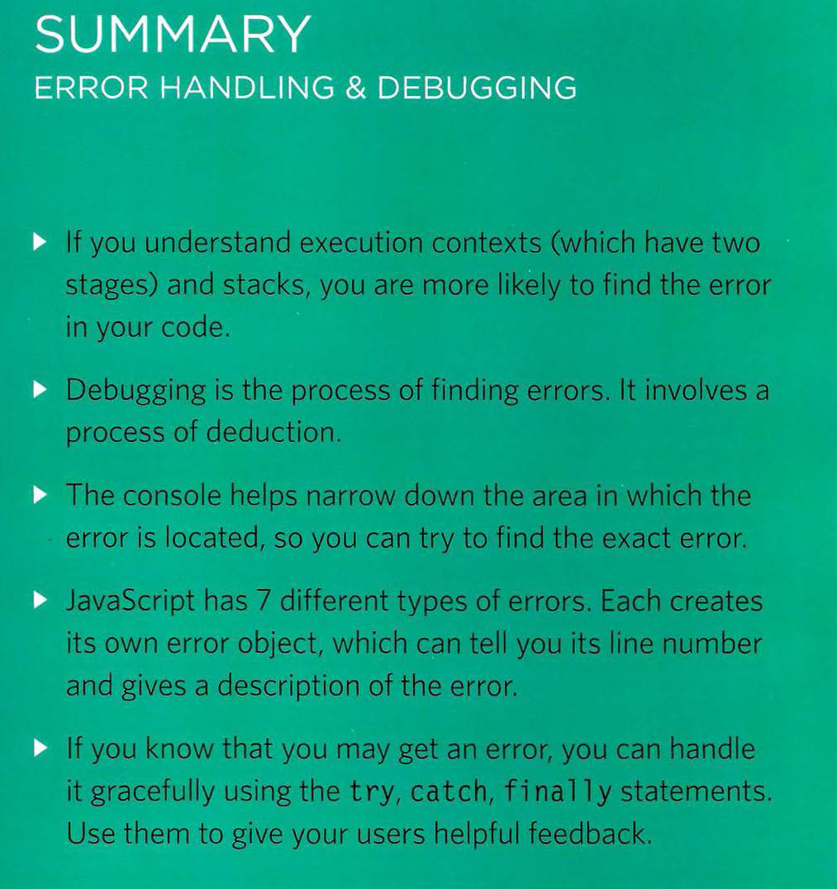

## Error Handling & Debugging:

**JavaScript** can be hard to learn and everyone makes
mistakes when writing it. This chapter will help you learn
how to find the errors in your code. It will also teach you how
to write scripts that deal with potential errors gracefully.

### ORDER OF EXECUTION :

+ To find the source of an error, it helps to know how scripts are processed.
The order in which statements are executed can be complex; some tasks
cannot complete until another statement or function has been run.

### EXECUT.ION CONTEXTS :

The JavaScript interpreter uses the concept of execution contexts.
There is one global execution context; plus, each function creates a new
new execution context. They correspond to variable scope.

**Every statement** in a script lives in one of three
execution contexts:

+ **GLOBAL CONTEXT :**
Code that is in the script, but not in a function.
There is only one global context in any page.

+ **FUNCTION CONTEXT:**
Code that is being run within a function.
Each function has its own function context.

+ **EVAL CONTEXT (NOT SHOWN)**
Text is executed .

**VARIABLE SCOPE**
The first two execution contexts correspond with the
notion of scope:

+ Global scope .

+ FUNCTION-LEVEL SCOPE.

## The slack :
The javascript interpreter processes one line of code at time .

### EXECUTION CONTEXT & HOISTING :

**Each time** a script enters a new execution context, there are two phases
of activity:

+ 1. PREPARE.

+ 2. EXECUTE.

### UNDERSTANDING SCOPE :

+ In the interpreter, each execution context has its own va ri ables object.
It holds the variables, functions, and parameters available within it.
Each execution context can also access its parent's v a ri ables object.

### UNDERSTANDING ERRORS :

+ **If a JavaScript** statement generates an error, then it throws an exception.
At that point, the interpreter stops and looks for exception-handling code.

+ If you are anticipating that something in your code may cause an error, you can use a set of statements
to handle the error . This is important because if the error is not handled, the script will just stop processing 
and the user will not know why. So exception-handling code should inform users when there is a problem.

### ERROR OBJECTS : 

**Error objects** can help you find where your mistakes are
and browsers have tools to help you read them.

When there is an error, you can see all of this information in the JavaScript console I Error console
of the browser.

### ERROR OBJECTS CONTINUED :
### Please note that these error messages are from the Chrome browser. Other browsers' error messages may vary.

 ;

**some common** examples of the kinds of errors you are likely to see.
As you can tell, the errors shown by the browsers can be rather cryptic.

### HOW TO DEAL WITH ERRORS :

**Now** that you know what an error is and how the browser treats them,
there are two things you can do with the errors :

+ 1: DEBUG THE SCRIPT TO FIX ERRORS.

+ 2: HANDLE ERRORS GRACEFULLY.

### A DEBUGGING WORKFLOW :

**WHERE IS THE PROBLEM?** 
**WHAT EXACTLY IS THE PROBLEM?**

+ First, should try to can narrow down the area where the problem seems to be. In a long script, this is
especially important.

+ Once you think that you might know the rough area in which your problem is located, you can then try to
find the actual line of code that is causing the error.

### BROWSER DEV TOOLS & JAVASCRIPT CONSOLE :

+ The JavaScript console will tell you when there is a problem with a script,

+ where to look for the problem, and what kind of issue it seems to be.

+ The JavaScript console is just one of severa l developer tools that are found in all modern browsers.
When you are debugging errors, it can help if you look at the error in more than one browser as they
can show you different error messages.

### HOW TO LOOK AT ERRORS IN CHROME :

+ The console will show you when there is an error in your JavaScript. It also displays the line
where it became a problem for the interpreter.

### TYPING IN THE CONSOLE IN CHROME :

You can also just type code into the console and it will show you a result.

### WRITING FROM THE SCRIPT TO THE CONSOLE :

+ Browsers that have a console have a console object, which has several methods that your script can use to display 
data in the console و The object is documented in the Console API.

### WRITING TABULAR DATA :

+ In browsers that support it, the console. table () method lets
you output a table showing:

**objects**

**arrays** that contain other objects or arrays.

### BREAKPOINTS :

+ You can pause the execution of a script on any line using breakpoints. Then you can check the
va lues stored in variables at that point in time.

### STEPPING THROUGH CODE :

+ If you set multiple breakpoints, you can step through them one-by-one to see where values
change and a problem might occur.

### CONDITIONAL BREAKPOINTS :

**You** can indicate that a breakpoint should be triggered only if a condition that you specify is
met. The condition can use existing variables.

### DEBUGGER KEYWORD :

+ You can create a breakpoint in your code using just the
debugger keyword. When the developer tools are open, this
will automatically create a breakpoint.

### HANDLING EXCEPTIONS :

### If you know your code might fail, use try, catch, and finally.
Each one is given its own code block.

### THROWING ERRORS:

+ If you know something might cause a problem for your script, you can
generate your own errors before the interpreter creates them.

## DEBUGGING TIPS:

+ Here are a selection of practical tips that you can try to use when debugging your scripts:

## SUMMARY :

