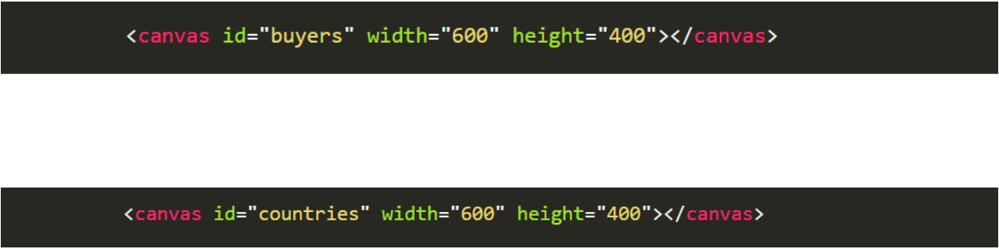
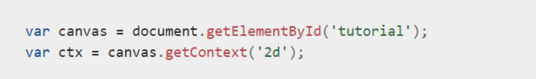

## charts

+ charts are the best way to display data than tables and more demonestrated.The first thing we need to do is download Chart.js ..A great way to get started with charts is with Chart.js, a JavaScript plugin that uses HTML5’s canvas element to draw the graph onto the page. It’s a well documented plugin that makes using all kinds of bar charts, line charts, pie charts and more, incredibly easy.

### Drawing a line chart
+ to draw a line chart the first thing we need is to create a canvas element in our html in which Chart.js can draw our chart. So add this to the body of our HTML page , we use first statment in the image .

### Drawing a pie chart
tocrete Drawing a pie chart we use the second statment here in the image . 

 

### Basic usage of canvas
+ The canvas element
At first sight a canvas looks like the img element, with the only clear difference being that it doesn't have the src and alt attributes. Indeed, the canvas element has only two attributes, width and height.

### Fallback content
+ The canvas element differs from an img tag in that, like for video, audio, or picture elements, it is easy to define some fallback content, to be displayed in older browsers not supporting it, like versions of Internet Explorer earlier than version 9 or textual browsers.

### The rendering context
+ canvas element creates a fixed-size drawing surface that exposes one or more rendering contexts, which are used to create and manipulate the content shown.

## Drawing shapes with canvas
### Drawing rectangles

+ canvas only supports two primitive shapes: rectangles and paths (lists of points connected by lines). All other shapes must be created by combining one or more paths.

### Drawing paths :
+ A path is a list of points, connected by segments of lines that can be of different shapes, curved or not, of different width and of different color . To make shapes using paths, we take some extra steps:

1- First, you create the path.

2- Then you use drawing commands to draw into the path.

3- Once the path has been created, you can stroke or fill the path to render it.

### Applying styles and colors : 
Colors
If we want to apply colors to a shape, there are two important properties we can use: fillStyle and strokeStyle.

### Drawing text

+ The canvas rendering context provides two methods to render text:

### fillText(text, x, y [, maxWidth]) Fills a given text at the given (x,y) position. Optionally with a maximum width to draw. strokeText(text, x, y [, maxWidth]) Strokes a given text at the given (x,y) position. Optionally with a maximum width to draw.