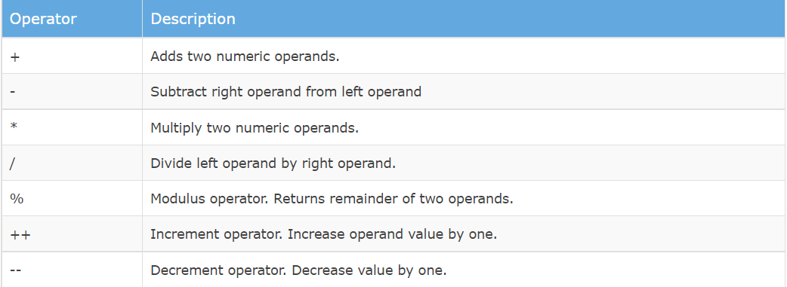
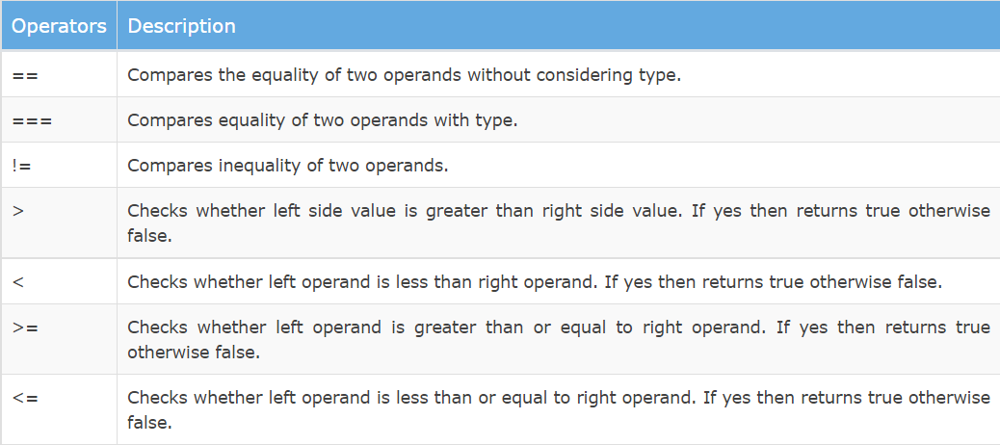
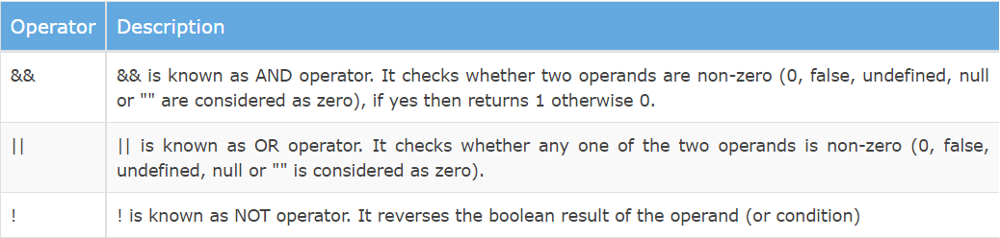
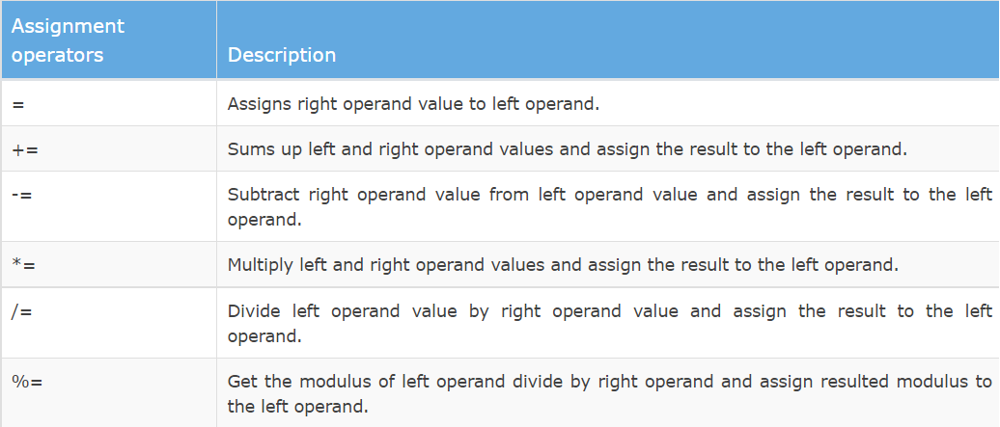
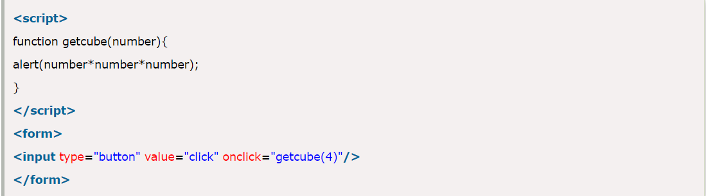
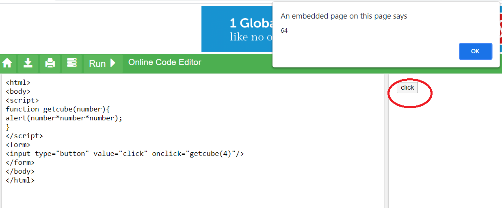

# Programming with JavaScript

+ ### JavaScript includes operators as in other languages. An operator performs some operation on single or multiple operands (data value) and produces a result. For example 1 + 2, where + sign is an operator and 1 is left operand and 2 is right operand. + operator adds two numeric values and produces a result which is 3 in this case.

### - JavaScript includes following categories of operators like:

- Arithmetic Operators
- Comparison Operators
- Logical Operators
- Assignment Operators
- Conditional Operators

### Arithmetic operators are used to perform mathematical operations between numeric operands:

### - Comparison Operators
JavaScript language includes operators that compare two operands and return Boolean value true or false :

 ### - Logical Operators
Logical operators are used to combine two or more conditions. JavaScript includes following logical operators:

### - Assignment Operators
JavaScript includes assignment operators to assign values to variables with less key strokes.

### -Ternary Operator
JavaScript includes special operator called ternary operator :? that assigns a value to a variable based on some condition. This is like short form of if-else condition.

## Functions:
** JavaScript functions ** are used to perform operations. We can call JavaScript function many times to reuse the code.

- ** Advantage of JavaScript function : **

** There ** are mainly two advantages of JavaScript functions :

- ** Code reusability: ** We can call a function several times so it save coding.

- ** Less coding: ** It makes our program compact. We don’t need to write many lines of code each time to perform a common task.

### * Defining functions:
- ** The name ** of the function.
- ** A list ** of parameters to the function, enclosed in parentheses and separated by commas.
- ** The JavaScript ** statements that define the function, enclosed in curly brackets, {...}.

 **For example** , the following code defines a simple function named square:

** function square(number) {
  return number * number;
} **

### * we use functios with httml to make the page live as we see in this example we create a button and we named it "click" and we called the function as we click the button the function will return to us the value who will show at the screen : 
 
 
 ## and here we go : 

 

- ## as we see there are alot of information and uses about function or operators so this was my summary about operatoprs and functios .