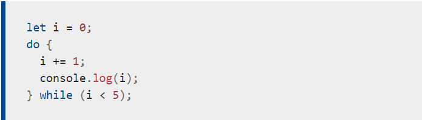

# Expressions , Operators and loops 

 ### we talking about operators at the last summary , and they are alot of operators else like : 

+ ### Comma operator:
The comma operator (,) evaluates both of its operands and returns the value of the last operand. This operator is primarily used inside a for loop, to allow multiple variables to be updated each time through the loop. It is regarded bad style to use it elsewhere, when it is not necessary. Often two separate statements can and should be used instead. 
+ ### Unary operators:
A unary operation is an operation with only one operand like : 
+ ** delet ** 
+ ** type of **
+ ** void **

# Expressions 

+ ### Primary expressions 
**Basic** keywords and general expressions in JavaScript , example :

- **this:**
Use the this keyword to refer to the current object. In general, this refers to the calling object in a method. 

+ ### Left-hand-side expressions 
** Left ** values are the destination of an assignment like : 
- **new** :You can use the new operator to create an instance of a user-defined object type or of one of the built-in object types. Use new as follows:
var objectName = new objectType([param1, param2, ..., paramN]);
- **super** :
 "The super keyword is used to call functions on an object's parent. It is useful with classes to call the parent constructor, for example.

 # loops 

 

### There are many different kinds of loops, but they all essentially do the same thing: they repeat an action some number of times.

**The** various loop mechanisms offer different ways to determine the start and end points of the loop. There are various situations that are more easily served by one type of loop over the others.

### The statements for loops provided in JavaScript are:

+ for statement
+ do...while statement
+ while statement
+ labeled statement
+ break statement
+ continue statement
+ for...in statement
+ for...of statement

### and we will give u an example for "do wile" loop:
In the following example, the do loop iterates at least once and reiterates until i is no longer less than 5

### - so we enough here , this was my summary .