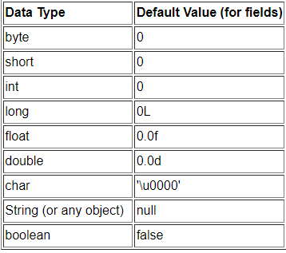
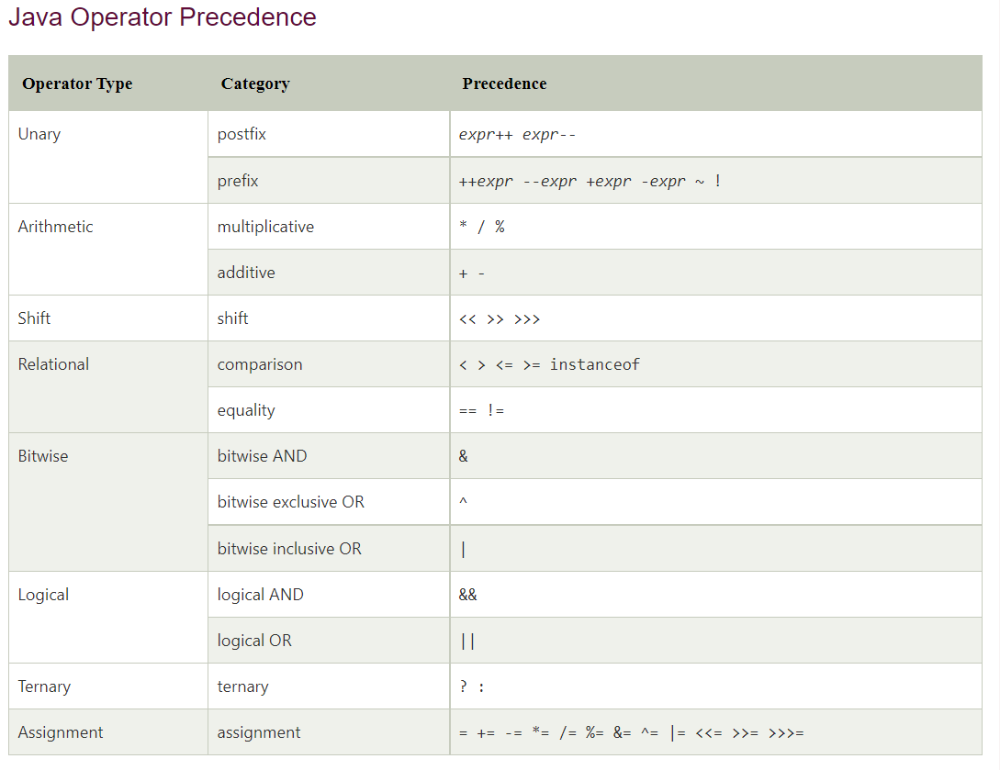
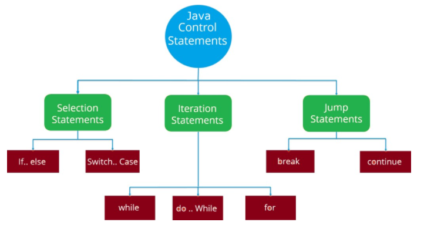

## Read: 01 - Java Basics

**Java** a programming language **Java is defined** by a specification and consists of a programming language, a compiler, core libraries and a runtime . 

### JAVA basics divided to :

- ## Variables :

**How to initialize variables?**
- **It can be** perceived with the help of 3 components that are as follows:
- datatype: Type of data that can be stored in this variable. 
- variable_name: Name given to the variable. 
- value: It is the initial value stored in the variable.

**types of variables:**
 * 1. Local Variables:The scope of these variables exists only within the block in which the variable is declared. i.e. we can access these variables only within that block.
 * 2. Instance Variables:Instance variables are non-static variables and are declared in a class outside any method, constructor,.. or block. 
 * 3. Static Variables: Static variables are also known as Class variables. 

**Primitive Data Types** :
- **The Java programming language** is statically-typed, which means that all variables must first be declared before they can be used. This involves stating the variable's type and name, as you've already seen:

**ex** declaration variables  : 
- " int num1" declared integer number with variable_name= num1 . 
-  "char y" , character with character_name y.
-  "string name1" , string with string_name name1.

**Arrays**:
An array is a container object that holds a fixed number of values of a single type. i.e : int [] arr1; declared array with integer numbers , int [5] arr1; declared array with integer numbers with size of 5 .

- ## Operators : 
**Operator in Java is a symbol that is used to perform operations. For example: +, -, *, / etc.**

- There are many types of operators in Java which are given below:

1. Unary Operator.
2. Arithmetic Operator.
3. Shift Operator.
4. Relational Operator.
5. Bitwise Operator.
6. Logical Operator.
7. Ternary Operator and .
8. Assignment Operator.

**Java Operator Precedence :**

## Expressions, Statements, and Blocks 

- Expressions are building blocks off all JAVA programs which are made up of variables, operators, and method invocations.
- A blocks in JAVA is a group of zero or more statements enclosed between braces.
- Statement forms a complete unit of execution. All statements are terminated with semicolon (;). 

 **As Simple as that** 

 ## Control Flow Statements:

 - Control flow statements are used to alter, redirect, or to control the flow of program execution based on the application logic.

**selection statements** allow you to control the flow of the program during run time on the basis of the outcome of an expression or state of a variable.
**Iteration statements** are used to execute the block of code repeatedly for a specified number of times or until it meets a specified condition.
**Jump statements** are used to alter or transfer the control to other section or statements in your program from the current section.

## compiling :

- What is the purpose of compiling Java?
The compiler translates your source code instructions into Java bytecode instructions. In other words, the compiler takes code that you can write and understand and translates it into code that a computer can execute . 

## How can i search about Java Documentation:

U should or have to be smart in searching , there is no stander solution for this kind of programmer prob's , until these ways that written by this intelligence writter it will help u but it will not fix this if u not take this skills and develope it inside u . 

