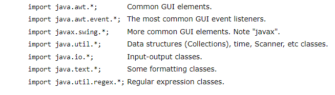

## Arrays, Loops, Imports

## Packages and Import :

-**packages** its the same of "directory". A package is a single folder (directory) containing a group of related classes (.java files) and interfaces.
- **Import statments** allowed you to name the packages from other libraries . 

### Package declaration :
-**A package declaration**, if used, must be the first thing in the file, and describes the folder in which it occurs.

### Package declaration syntax:
- **The statement order** is as follows. Comments can go anywhere.
1. Package statment (optional).
2. Imports (optional).
3. Class or interface definitions.

### Imports: three options:

if we take an example to see what the three options , we have JOptionPane class , this class located in the swing package  which is located in the javax package.

**The wildcard character (*)** is used to specify that all classes with that package are available to your program:
- import javax.swing.*;  // Make all classes visible altho only one is used.

**Classes can be specified explicitly** on import instead of using the wildcard character:
-import javax.swing.JOptionPane;  // Make a single class visible.

**Alternately** we can the fully qualified class name without an import like in this ex :
- class ImportTest {
    public static void main(String[] args) {
        **javax.swing**.JOptionPane.showMessageDialog(null, "Hi");
        System.exit(0);
    }}

### Common imports :

**Java 5 added** an import static option that allows static variables (typically constants) to be referenced without qualifying them with a class name.

## A Guide to Java Loops :

- **Types of loops** that we can find in Java:
* Simple for loop
* Enhanced for-each loop
* While loop
* Do-While loop

### for-loop :
* an entry-controlled loop that facilitates a user to execute a block of a statement(s) iteratively for a fixed number of times. 

### while loop :
* a control flow statement that allows code to be executed repeatedly based on a given Boolean condition.

### Do-While Loop :
* is used to iterate a part of the program repeatedly, until the specified condition is true.

