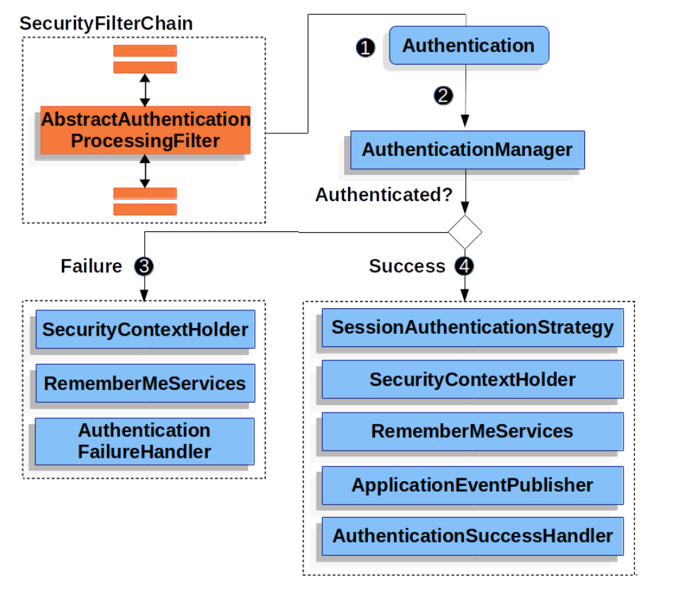
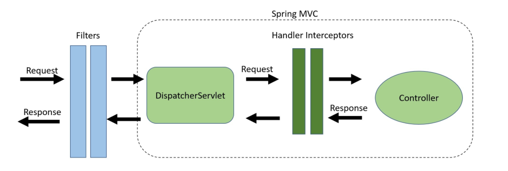

## Authentication and Access Control
### What is Authentication ?
- **Verifying the identity** of a user to determine whether the user is allowable to access resources in an information system or not.

- **We use Authentication** in Spring boot by using the annotation AuthenticationManager. it can do three options :

- **if true** it will authenticate the user.
- **if (Invalid)** it throws an exception.
- **null** if it can not decide.

### Customizing Authentication Managers
- **AuthenticationManagerBuilder :** allows for building in memory authentication, UserDetailsService and adding Authentication Provider.
Web Security
this is used for UI and backend , it's totally depends on Servlet Filters. so once the user send a request it decides which Servlet depends on the path request. we must also notice that the security felter is a Bean in the ApplicationContext. this can explain as well :

### Method Security
- **It mainly used** to decied if the request should be authenticated. we basiclly use it in two steps :

* **Configure Spring** security using. security:http. ...
* **Configure Spring** such that the prefix. /views.
* **Finally / we** must notice that spring boot is thread-bound

- **Working with Threads** and Processing Secure Methods Asynchronously
at first we have to Enable async processing by this annotation : @EnableAsync then Create a ThreadPoolExecutor to run async methods eahc in a seperate thread finally we have to put the @Async annotation before the methods that we need to run it seperetly in threads .