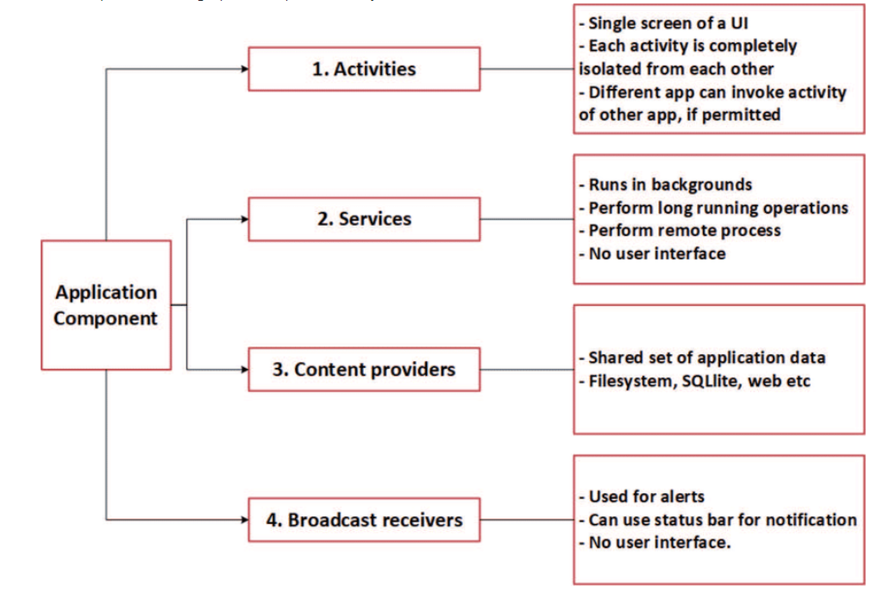

## Application Fundamentals
- The language that we will be using is JAVA , however Kilton and C++ may be used as well.
- The extension of android file is .apk
- Some security features are used Android security, one of them that by default each app has the access only to the components require to do its work and no more.

### App components
- It's the building block of the app , each component is the entry point and they may be related.

- There are four different types of app components:

* **Activities**
* **Services**
* **Broadcast receivers**
* **Content providers this graph can explain it breifly.**

